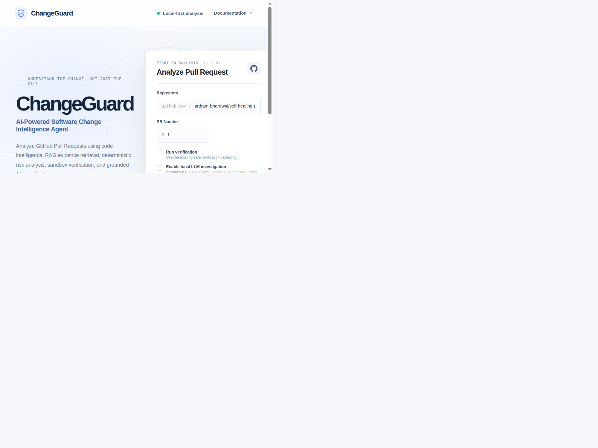
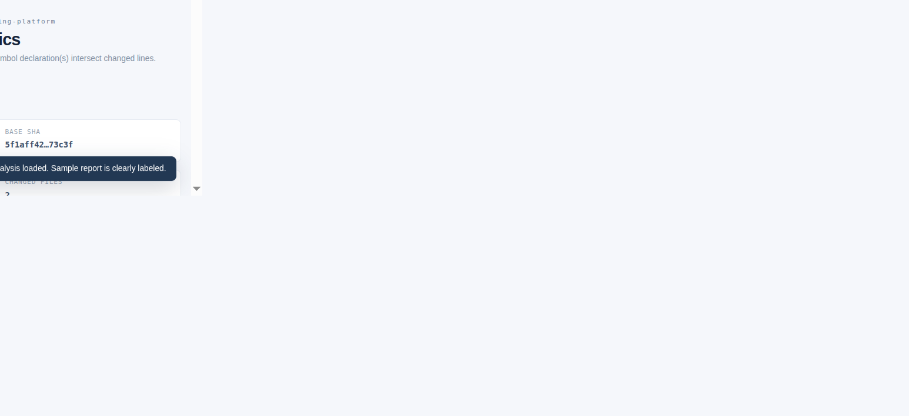
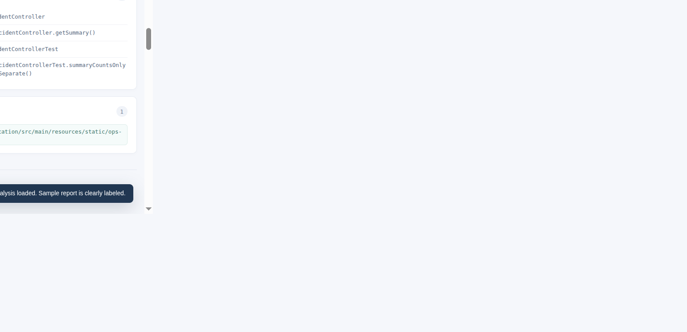
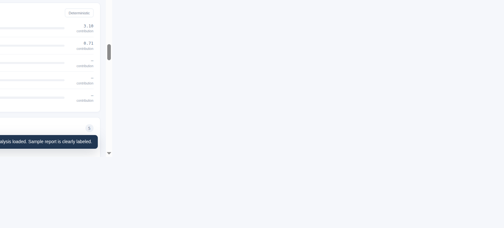
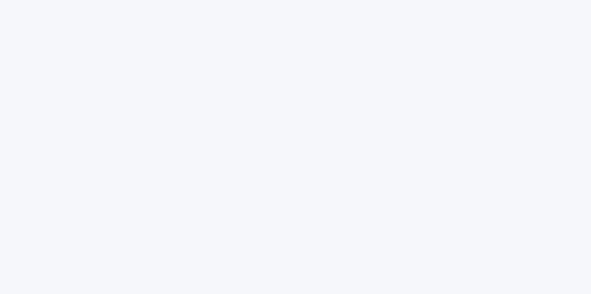

# ChangeGuard

ChangeGuard is an AI software engineering agent that analyzes GitHub pull requests using deterministic code intelligence, MCP tool calling, RAG-based engineering evidence retrieval, sandbox verification, and grounded LLM investigation.

## Problem

Large codebases make it difficult to understand the real impact of a pull request. A diff shows what changed, but not which methods, APIs, frontend consumers, historical signals, or verification gaps matter before merge.

## Solution

ChangeGuard builds an evidence-backed understanding of software changes. It uses immutable revision analysis, code intelligence, cross-language API mapping, local evidence retrieval, deterministic risk scoring, and a bounded AI investigation to explain what changed and what may be affected.

## Architecture

```text
Developer PR
    ↓
GitHub Integration
    ↓
Code Intelligence
    ↓
API Impact Graph
    ↓
RAG Evidence
    ↓
Risk Engine
    ↓
Verification Sandbox
    ↓
AI Agent
    ↓
Grounded Report
```

## Features

- GitHub PR analysis
- Java code intelligence
- Cross-language API impact
- RAG evidence retrieval
- MCP tool-based AI agent
- deterministic risk engine
- sandbox verification
- evaluation framework

## Demo

The local demo is a lightweight, browser-based presentation layer around the existing ChangeGuard analysis flow. It can load a real PR result or a realistic saved sample without requiring GitHub credentials.

<p align="center">
  
</p>

<p align="center">
  
</p>

<p align="center">
  
</p>

<p align="center">
  
</p>

<p align="center">
  
</p>

## Running locally

Python 3.12 or later is recommended.

```sh
python -m venv .venv
. .venv/bin/activate
python -m pip install -r requirements.txt
python -m changeguard.demo_server
```

Then open <http://127.0.0.1:8000> in a browser.

For a private repository, set `GITHUB_TOKEN` in the local environment before starting the demo server. The browser never receives GitHub credentials.

## Example Output

```text
PR: artham-bhardwaj/self-healing-platform#1
Changed files: 2
Changed symbols: 2 methods
API impact: 14 endpoints · 13 consumers · 10 deterministic edges
Risk: LOW · 7.96 / 100 (47.86% weight coverage)
Verification: BLOCKED · Java/Maven unsupported by the configured verifier
LLM: sample report only; no live model output was recorded for the saved PR
```

## Limitations

- Java and API resolution are intentionally conservative and may leave some relationships unresolved.
- Verification is opt-in and limited to the existing supported checks.
- Grounded AI investigation depends on the local environment and the available evidence.
- The demo is intended for loopback-only local use and does not add authentication, cloud hosting, or persistent storage.
